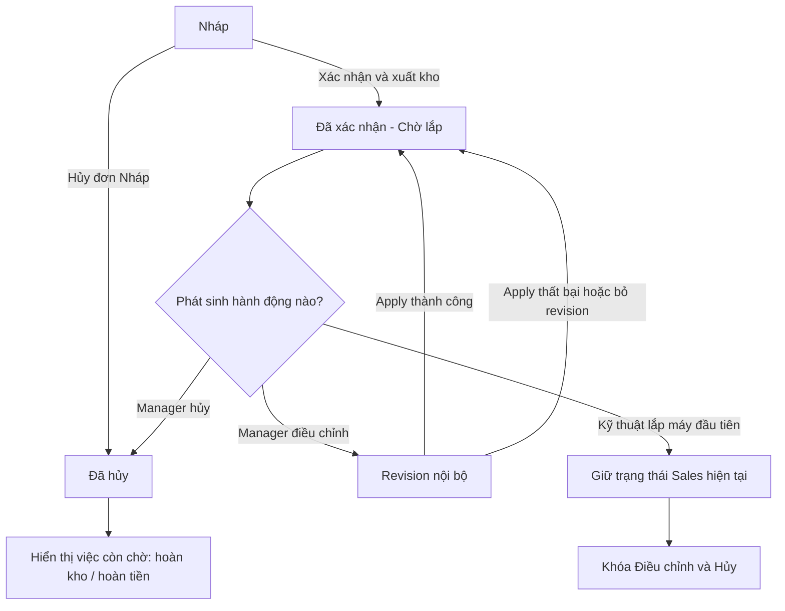
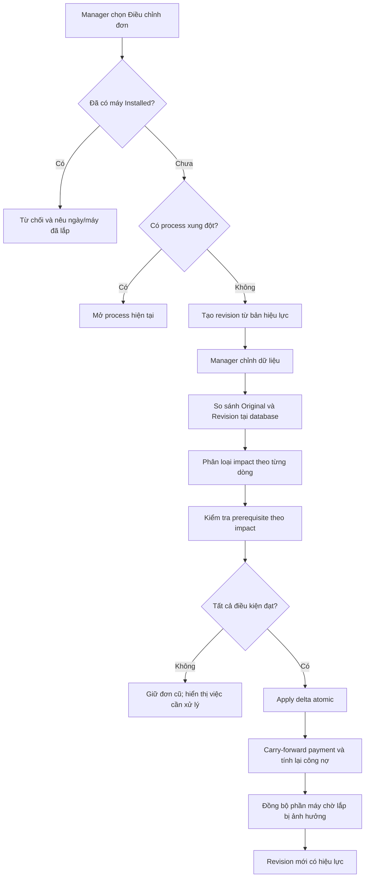
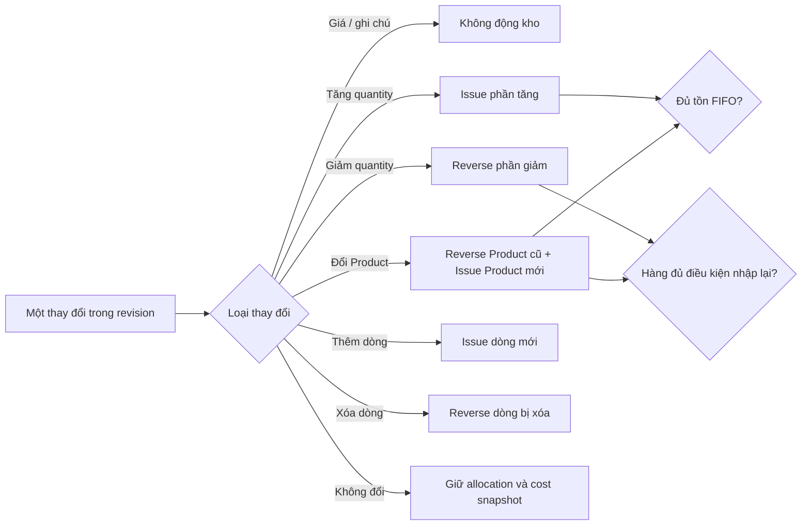
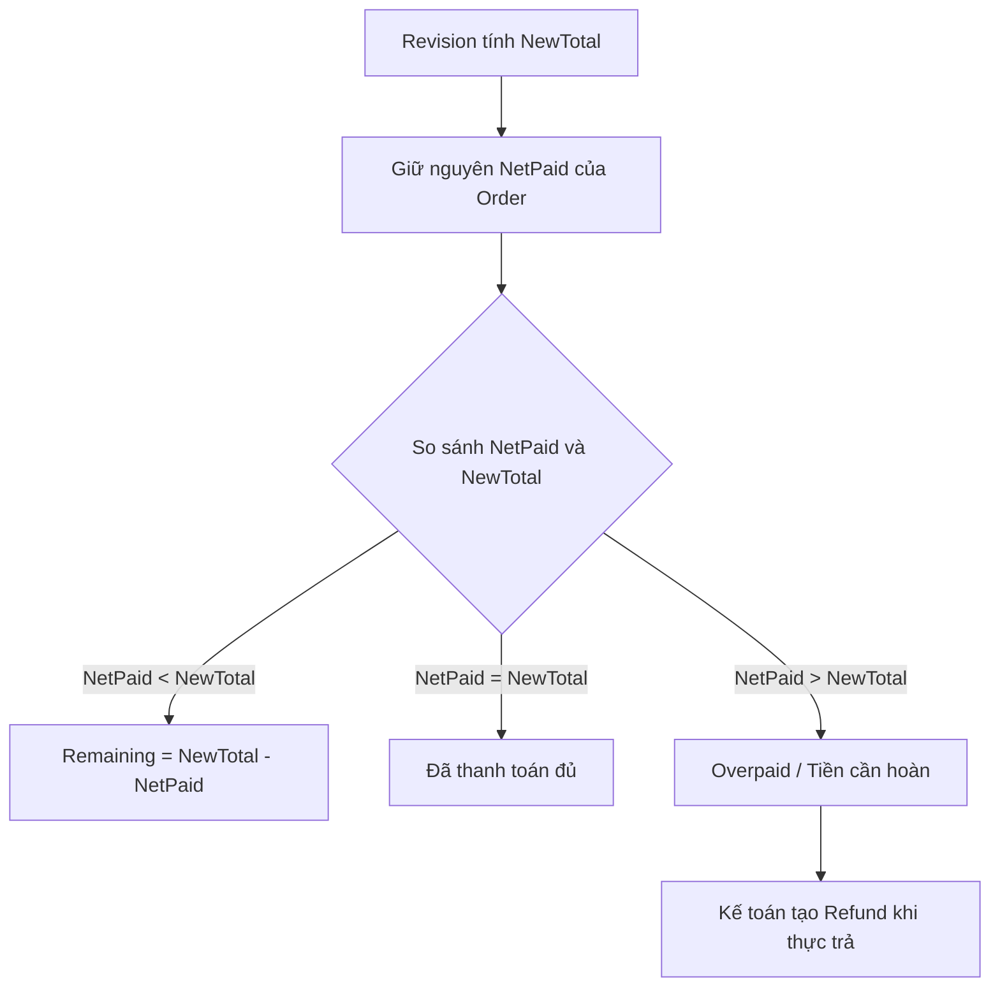
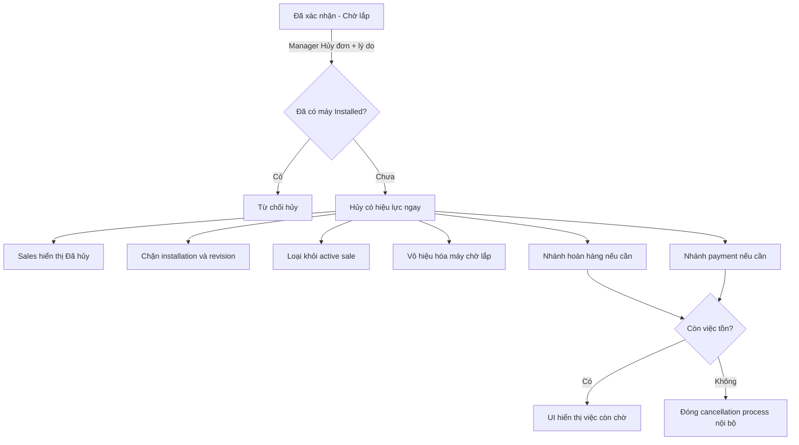
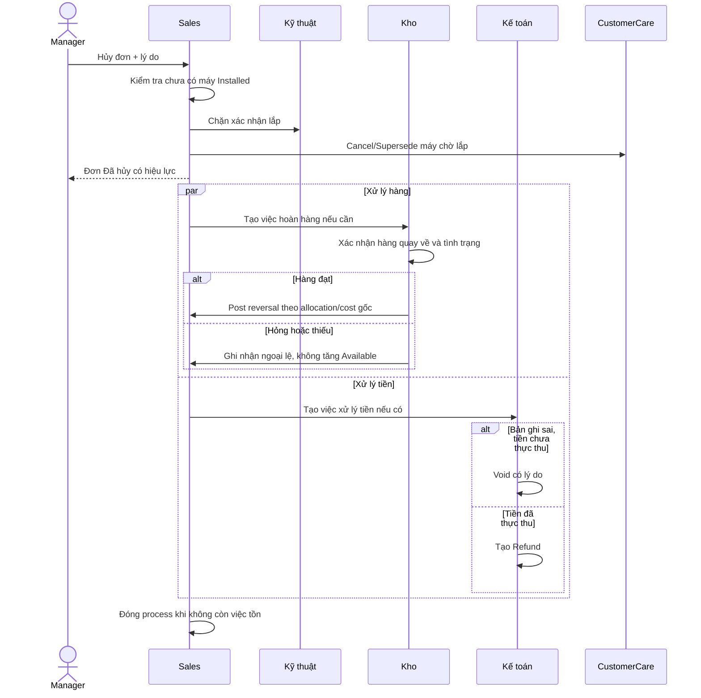
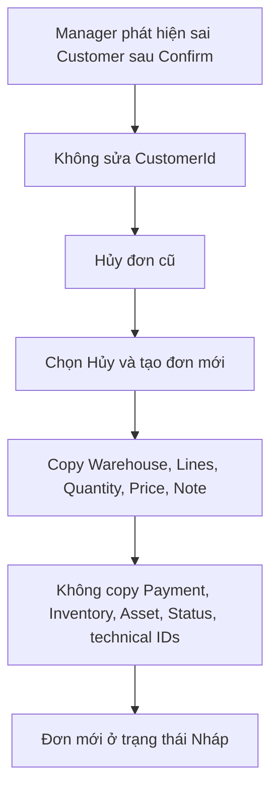
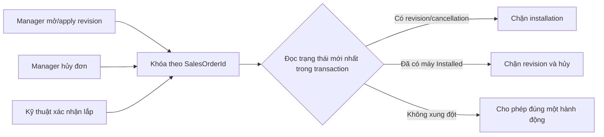
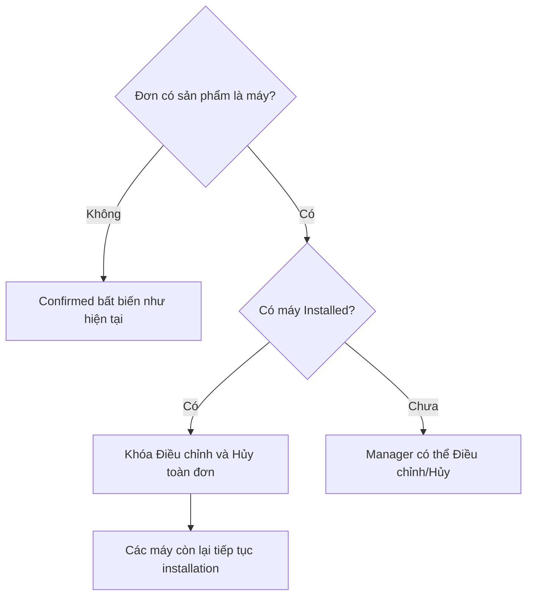

# Mô hình luồng V1 điều chỉnh và hủy đơn trước lắp đặt

Tài liệu này minh họa business target trong `SALES_PRE_INSTALLATION_CHANGE_CANCELLATION_BUSINESS_SPEC.md`.

## 1. Mô hình người dùng tối giản

Người dùng chỉ thấy `Nháp`, `Đã xác nhận - Chờ lắp`, `Đã hủy` và thông tin khóa/việc còn chờ. Revision và cancellation process là dữ liệu nội bộ.

## 2. Luồng điều chỉnh theo delta

## 3. Ma trận xử lý impact

## 4. Payment carry-forward

Không hoàn tiền rồi thu lại chỉ vì revision thay đổi tổng đơn.

## 5. Hủy có hiệu lực sớm

## 6. Hai nhánh sau hủy

## 7. Sai khách hàng

## 8. Khóa tranh chấp

## 9. Ranh giới V1

